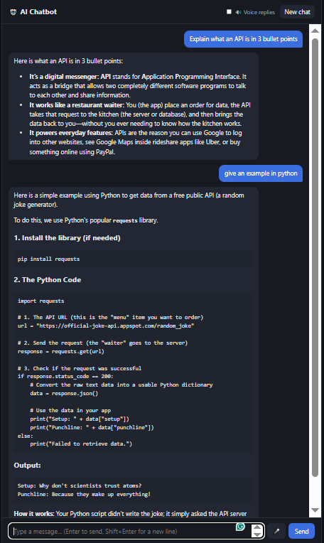

# AI Chatbot

A web chatbot built with Python (Flask) and Google's Gemini API. You type a message (or say it), the server sends it to Gemini along with the earlier conversation, and the reply appears in the chat formatted as Markdown. It can also read the reply out loud.



## What I built

The core requirement works end to end: the user sends a message, the app sends it to the AI, gets the response back and shows it.

I also added these bonus features:

| Feature | How it works |
|---|---|
| Conversation history | The browser keeps the whole chat and sends it with every request, so the model remembers earlier messages. Only the last 20 messages are sent. |
| System prompt | Set on the server (`SYSTEM_PROMPT` in `app.py`, can be overridden in `.env`). It sets the bot's tone and asks it to use Markdown. |
| Loading state | An animated "typing" bubble appears while the server waits for Gemini, and the Send button is disabled. |
| Error handling | The server validates input and turns Gemini errors (bad key, rate limit, model not found, outage, network) into readable messages. If Gemini is temporarily overloaded (5xx), the server retries up to 3 more times with increasing delays. If it still fails, the UI shows a red bubble with a **Try again** button, and the failed message is removed from history so nothing is lost. |
| Basic UI | Chat bubbles, auto-growing input, Enter to send / Shift+Enter for a new line, "New chat" button, dark mode support. |
| Markdown responses | Replies are rendered with `marked` and cleaned with `DOMPurify` so the model's output can't inject HTML or scripts into the page. |
| Voice input | 🎤 button uses the browser's Web Speech API to turn speech into text (Chrome / Edge). |
| Voice output | "Voice replies" toggle reads answers aloud using the browser's speech synthesis. |

## Technology used

- **Python 3.10+** with **Flask** for the backend
- **Google Gemini API** via the official `google-genai` SDK (free tier, model `gemini-flash-latest`)
- **python-dotenv** to load the API key from `.env`
- **HTML, CSS and plain JavaScript** for the frontend (no framework)
- **marked** + **DOMPurify** (loaded from a CDN) for safe Markdown rendering
- **Web Speech API** (built into the browser) for voice input and output
- **unittest** for backend tests, with the Gemini client mocked

## How to run it

1. **Get a free Gemini API key** at https://aistudio.google.com/apikey

2. **Clone the repo and install dependencies**
   ```bash
   git clone <your-repo-url>
   cd AI-chatbot
   python -m venv .venv
   # Windows
   .venv\Scripts\activate
   # macOS / Linux
   source .venv/bin/activate
   pip install -r requirements.txt
   ```
   > On Windows PowerShell, if activation fails with "running scripts is disabled", run
   > `Set-ExecutionPolicy -Scope CurrentUser RemoteSigned` once, or skip activation and use
   > `.venv\Scripts\python.exe` in place of `python`.

3. **Add your key.** Copy `.env.example` to `.env` and paste your key in:
   ```
   GEMINI_API_KEY=your-real-key
   ```
   `.env` is listed in `.gitignore`, so the key never gets committed.

4. **Start the server**
   ```bash
   python app.py
   ```

5. Open **http://127.0.0.1:5000** in your browser and start chatting.

**Windows shortcut:** after the first-time setup, double-click `start.bat`. It starts the server and opens the browser for you.

**Run the tests** (no API key needed):
```bash
python -m unittest discover tests
```

## How it works

```
Browser (static/app.js)            Flask (app.py)                 Gemini API
───────────────────────            ──────────────                 ──────────
user types message
history.push(user msg)
POST /api/chat {messages} ───────▶ validate input
                                   convert roles (assistant→model)
                                   add system prompt
                                   generate_content() ──────────▶ model replies
                                   ◀──────────────────────────── response.text
◀─────────────────── {reply} ───── return JSON (or {error})
render Markdown, speak (optional)
history.push(assistant msg)
```

### Project structure

```
app.py               Flask server: serves the page and the /api/chat endpoint
templates/index.html The chat page
static/app.js        Frontend logic: history, fetch, rendering, voice
static/style.css     Styling (light + dark)
tests/test_app.py    Backend tests with a mocked Gemini client
.env.example         Template for your API key
```

## API integration approach

- **The API key stays on the server.** The browser only talks to my Flask backend, never to Gemini directly, so the key is never sent to the user's browser. The key is read from `.env`, which is gitignored.
- **Stateless backend.** The server doesn't store conversations. The frontend sends the full history on each request, and the server forwards the last 20 messages. That keeps the server simple, and a restart doesn't break anything.
- **Message format conversion.** The frontend uses the common `user` / `assistant` roles. Gemini calls the assistant role `model`, so `to_gemini_contents()` converts them before calling `client.models.generate_content()`.
- **System prompt** is passed through `GenerateContentConfig(system_instruction=...)`, separate from the chat messages.
- **Errors are mapped to friendly messages.** The SDK raises `ClientError` for 4xx responses and `ServerError` for 5xx. I check the status code (429 means rate limited, 404 means bad model name, and so on) and send back a clear message instead of a stack trace.
- **Model is configurable.** `GEMINI_MODEL` in `.env` lets you switch models without touching code. The default, `gemini-flash-latest`, is an alias that always points at the current Flash model.

## What I learned

**The model doesn't remember anything.** I assumed the API kept track of the conversation, but every request is independent. "Memory" is just the app sending the earlier messages back each time. Once I understood that, conversation history was easy to add, and it also explained why long chats cost more tokens.

**Keeping secrets out of Git takes more care than I expected.** When setting up I pasted my API key into `.env.example` instead of `.env`. `.env.example` is committed, so the key would have ended up public on GitHub. I caught it before pushing. Now I always run `git status` and check what's staged before I commit.

**External APIs fail, and the app has to deal with it.** While testing, Gemini's free tier sometimes returned a 503 "high demand" error. At first that showed up as an error and I refreshed the page, which wiped the chat. I added automatic retries with increasing delays on the server and a "Try again" button in the UI, so a temporary outage doesn't lose the conversation.

**Old environment values can stick around.** After I fixed my key, the app still said it was rejected. The server had started before the key was in `.env`, and Flask's debug reloader kept passing the old placeholder value to the restarted process. Using `load_dotenv(override=True)` fixed it. It took a while to work out because the `.env` file itself was correct.

**Smaller things:**
- The system prompt is sent separately from the chat messages and controls the bot's tone and formatting.
- Model output should be treated as untrusted. I render the Markdown replies through DOMPurify so a reply can't inject HTML or scripts into the page.
- Gemini calls the assistant role `model` instead of `assistant`, so I convert the roles before each request.
- I can test code that calls an API without a key or internet by mocking the client.
- Git on Windows ignores filename case but GitHub doesn't. My screenshot was saved as `screenshot.PNG` and the image link broke until I renamed it to `.png`.

## What I would improve next

- **Streaming responses** so text shows up word by word instead of all at once (Gemini supports `generate_content_stream`).
- **Save chats** in the browser (localStorage) or a database so they survive a page refresh, and allow several conversations.
- **Smarter history handling:** summarise old messages instead of just dropping everything past the last 20.
- **Deploy it** (Render, Railway, etc.) with basic rate limiting so a public URL can't burn through the API quota.
- **File and image upload,** since Gemini is multimodal.
- Let the user pick a model or change the system prompt from the UI.
