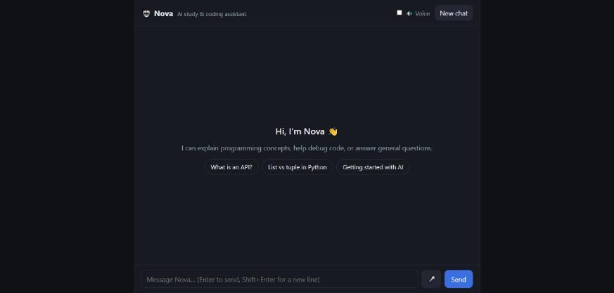
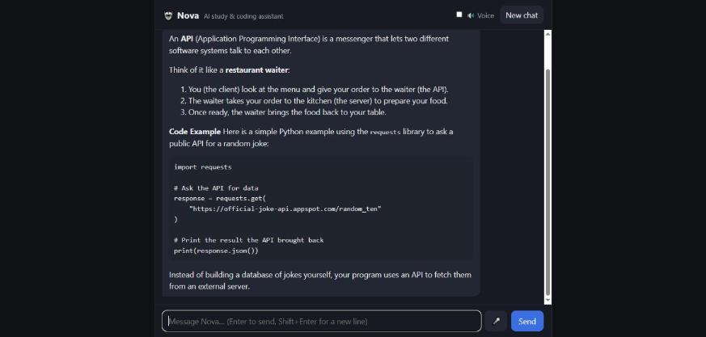

# Nova – AI Chatbot

[](https://github.com/huzaifaguru/AI-chatbot/actions/workflows/tests.yml)

Nova is a web chatbot built with Python (Flask) and Google's Gemini API. It's set up as a study and coding assistant for students: it explains concepts with examples, helps debug code, and answers general questions. Replies stream in word by word, are formatted as Markdown, and can be read out loud. The chat is saved in the browser, so a refresh doesn't lose it.

| Welcome screen | Conversation |
|---|---|
|  |  |

The repo has been built up over the internship tasks:

- **Day 1:** basic chatbot (tagged [`day-1`](https://github.com/huzaifaguru/AI-chatbot/tree/day-1))
- **Day 2:** defined persona and a structured system prompt
- **Day 3:** streaming, saved chats, rate limiting, context budget, health check, CI

## Features

### Day 2: complete chatbot with a defined role

| Requirement | How it's done |
|---|---|
| User input | Auto-growing text box (Enter to send, Shift+Enter for a new line), suggestion buttons, voice input |
| AI response | Gemini replies, streamed into the chat as they're generated |
| Proper API integration | Official `google-genai` SDK called from the backend only. The key never reaches the browser. Retries with backoff when Gemini is overloaded. |
| Loading state | Typing animation until the first words arrive. The Send button turns into a red **Stop** button while a reply streams. |
| Error handling | Every failure becomes a readable message with a **Try again** button (see [Problems and solutions](#problems-and-solutions)) |
| Clean basic interface | Chat bubbles, welcome screen, light and dark mode, works on mobile widths |
| **System prompt / personality** | Nova's persona lives in [`prompts/system_prompt.md`](prompts/system_prompt.md), split into Role, Personality, How to answer, and Honesty and limits |

### Day 3: improvements

The task asked for at least 2. These are the ones I added, with the focus on making it more production-ready:

| Improvement | What it does |
|---|---|
| **Streaming responses** | Text appears as Gemini generates it (Server-Sent Events) instead of after a long wait. **Stop** cancels mid-reply and keeps what arrived. |
| **Saved conversation** | History is stored in `localStorage`, so a refresh or an accidental close doesn't wipe the chat. **New chat** clears it. |
| **Context/memory budget** | The server sends at most the last 20 messages *and* at most 16,000 characters, dropping the oldest first, so long chats keep working instead of eventually failing. |
| **Rate limiting** | At most 15 messages per minute per IP address (configurable), so a shared link can't burn through the free API quota |
| **Better prompt structure** | The system prompt moved out of the code into its own Markdown file with clear sections. It can be edited without touching Python. |
| **Input validation** | Server checks roles, empty or oversized messages and conversation shape. The browser also caps input at 4,000 characters. |
| **Response/error handling** | Errors before streaming come back as normal HTTP errors. Errors mid-stream arrive as an error event. Empty or blocked replies are detected. |
| **Health check** | `GET /api/health` reports whether the server is up and the key is configured, which is useful for monitoring or deployment |
| **Logging** | Each request logs message count and latency, and Gemini errors are logged with details (the user sees a clean message) |
| **Automated tests + CI** | 18 tests run on every push via GitHub Actions (badge at the top) |
| Better UI | Persona header, welcome screen with suggestion buttons, Stop button, mobile layout |

### From Day 1 (still included)

Conversation history, Markdown rendering (sanitised with DOMPurify), voice input (🎤, Chrome/Edge) and voice output (🔊 toggle).

## Technology used

- **Python 3.10+** with **Flask** for the backend
- **Google Gemini API** via the official `google-genai` SDK (free tier, default model `gemini-flash-lite-latest`)
- **python-dotenv** for configuration from `.env`
- **HTML, CSS and plain JavaScript** for the frontend (no framework), using `fetch` streams to read Server-Sent Events
- **marked** + **DOMPurify** for safe Markdown rendering
- **Web Speech API** (built into the browser) for voice input and output
- **unittest** + **GitHub Actions** for automated testing

## How to run it

1. **Get a free Gemini API key** at https://aistudio.google.com/apikey

2. **Clone the repo and install dependencies**
   ```bash
   git clone https://github.com/huzaifaguru/AI-chatbot.git
   cd AI-chatbot
   python -m venv .venv
   # Windows
   .venv\Scripts\activate
   # macOS / Linux
   source .venv/bin/activate
   pip install -r requirements.txt
   ```
   > On Windows PowerShell, if activation fails with "running scripts is disabled", run
   > `Set-ExecutionPolicy -Scope CurrentUser RemoteSigned` once, or skip activation and use
   > `.venv\Scripts\python.exe` in place of `python`.

3. **Add your key.** Copy `.env.example` to `.env` and paste your key in:
   ```
   GEMINI_API_KEY=your-real-key
   ```
   `.env` is listed in `.gitignore`, so the key never gets committed. `.env.example` also lists the optional settings (model, rate limit, prompt file).

4. **Start the server**
   ```bash
   python app.py
   ```

5. Open **http://127.0.0.1:5000** in your browser and start chatting.

**Windows shortcut:** after the first-time setup, double-click `start.bat`. It starts the server and opens the browser for you.

**Run the tests** (no API key needed):
```bash
python -m unittest discover tests
```

## Architecture

```
┌──────────────────────────┐         ┌─────────────────────────────────┐        ┌────────────┐
│ Browser  (static/app.js) │         │ Flask server  (app.py)          │        │ Gemini API │
│                          │  POST   │                                 │        │            │
│ history in localStorage  │────────▶│ 1. rate limit (per IP)          │        │            │
│ sends full history       │ /api/   │ 2. validate messages            │        │            │
│                          │ chat/   │ 3. trim to context budget       │        │            │
│                          │ stream  │ 4. add system prompt (file)     │ stream │            │
│                          │         │ 5. generate_content_stream() ───┼───────▶│            │
│ renders Markdown as      │◀────────│ 6. forward chunks as SSE    ◀───┼────────│            │
│ each chunk arrives       │  SSE    │    (retries 5xx with backoff)   │        │            │
│ Stop = AbortController   │         │                                 │        │            │
└──────────────────────────┘         └─────────────────────────────────┘        └────────────┘
```

### Request lifecycle

1. The user sends a message. The browser adds it to `history`, saves it to `localStorage`, and POSTs the full history to `/api/chat/stream`.
2. The server checks the **rate limit** (429 if exceeded), then **validates** the body (400 if malformed).
3. `trim_history()` keeps the newest messages that fit in **20 messages / 16,000 characters**.
4. Roles are converted (`assistant` → `model`, Gemini's name for it) and the **system prompt** from `prompts/system_prompt.md` is attached as `system_instruction`.
5. The server calls `generate_content_stream()` and waits for the **first chunk** before replying. Because of that, problems like a bad key or an overloaded model come back as a normal HTTP error with a clear message. The SDK retries 500/502/503/504 up to 3 times with growing delays.
6. Each chunk is sent to the browser as a Server-Sent Event: `data: {"text": "..."}`, then `{"done": true}`, or `{"error": "..."}` if the connection fails mid-reply.
7. The browser re-renders the Markdown as text arrives. When the reply finishes, it's added to `history` and saved.

The server is **stateless**: it stores no conversations, so restarting it never loses a chat, and it would be easy to run several copies behind a load balancer. (The rate limiter is the exception; it's in memory, see "What I would improve next".)

### API endpoints

| Method | Path | Purpose |
|---|---|---|
| `GET` | `/` | The chat page |
| `POST` | `/api/chat/stream` | Streams the reply as Server-Sent Events (used by the UI) |
| `POST` | `/api/chat` | Same, but returns the whole reply as JSON (handy for scripts and testing) |
| `GET` | `/api/health` | `{"status": "ok", "model": ..., "api_key_configured": true}` |

Both chat endpoints take `{"messages": [{"role": "user" | "assistant", "content": "..."}]}`.

### Project structure

```
app.py                    Flask server: validation, rate limiting, Gemini calls, streaming
prompts/system_prompt.md  Nova's persona and rules (the system prompt)
templates/index.html      The chat page
static/app.js             Frontend: history + localStorage, streaming, Stop, retry, voice
static/style.css          Styling (light + dark, mobile)
tests/test_app.py         18 backend tests with a mocked Gemini client
.github/workflows/        GitHub Actions: runs the tests on every push
.env.example              Template for the API key and optional settings
start.bat                 Windows one-click launcher
```

## API integration approach

- **The API key stays on the server.** The browser only talks to the Flask backend, never to Gemini directly. The key is read from `.env`, which is gitignored.
- **Official SDK.** `google-genai` handles authentication, retries and streaming. The client is created once and reused.
- **Streaming over SSE.** `generate_content_stream()` yields chunks, which Flask forwards as Server-Sent Events. The browser reads them with `fetch()` and a stream reader, because the built-in `EventSource` only supports GET requests.
- **Retries with exponential backoff** for 5xx errors (`HttpRetryOptions`: 4 attempts, 1s → 8s). I confirmed it works when the free tier returned "503 high demand" during testing.
- **Errors mapped to friendly messages.** `ClientError` (4xx) and `ServerError` (5xx) are turned into specific messages: bad key, quota reached, model not found, Gemini busy, no internet. Details go to the server log, not the user.
- **Configurable without code changes:** model, rate limit and prompt file are all set in `.env`.

## Problems and solutions

| Problem | Cause | Solution |
|---|---|---|
| "Gemini is having problems" appeared randomly | Gemini's free tier returns **503 "high demand"** under load | Automatic retries with exponential backoff, plus a **Try again** button that resends without losing the chat |
| Refreshing after an error wiped the chat | History only lived in a JavaScript variable | Save history to `localStorage` and restore it on page load |
| Replies took 15–35 seconds | `gemini-flash-latest` was slow on the free tier because of queueing | Measured the alternatives: `gemini-flash-lite-latest` answered in **under 2 seconds**, so it's now the default. The model can still be changed in `.env`. Streaming also makes the wait feel shorter. |
| "API key was rejected" although `.env` was correct | The server started before the key was saved, and Flask's debug reloader passed the old value to the restarted process | `load_dotenv(override=True)` so the latest `.env` always wins |
| API key almost committed to GitHub | Key pasted into `.env.example` (which is committed) instead of `.env` | Caught it with `git status` before pushing. Moved it to `.env`. |
| A long conversation would eventually fail | Every message was resent, so requests kept growing | Context budget: last 20 messages and 16,000 characters max |
| A public link could use up the free quota | No limit on requests | Per-IP rate limit (15/minute) returning HTTP 429 |
| Errors during streaming couldn't use HTTP status codes | Once streaming starts, the 200 status is already sent | Wait for the first chunk before responding (early errors become normal HTTP errors) and send later errors as an `error` event |
| Screenshot didn't show on GitHub | Saved as `screenshot.PNG`. Windows ignores case but GitHub doesn't. | Renamed to lowercase `.png` |
| Clicking "New chat" during a reply could leak the old reply into the new chat | The stopped request finished after the chat was cleared | Each chat gets an ID, and replies from an old chat are ignored |

## What I learned

**The model doesn't remember anything.** I assumed the API kept track of the conversation, but every request is independent. "Memory" is just the app sending the earlier messages back each time. Once I understood that, conversation history was easy to add, and it also explained why long chats cost more tokens. On Day 3 I added a limit on how much history gets sent for the same reason.

**Keeping secrets out of Git takes more care than I expected.** When setting up I pasted my API key into `.env.example` instead of `.env`. `.env.example` is committed, so the key would have ended up public on GitHub. I caught it before pushing. Now I always run `git status` and check what's staged before I commit.

**External APIs fail, and the app has to deal with it.** While testing, Gemini's free tier sometimes returned a 503 "high demand" error. At first that showed up as an error and I refreshed the page, which wiped the chat. I added automatic retries with increasing delays on the server and a "Try again" button in the UI, and on Day 3 I made the chat save itself so a refresh doesn't lose anything.

**Old environment values can stick around.** After I fixed my key, the app still said it was rejected. The server had started before the key was in `.env`, and Flask's debug reloader kept passing the old placeholder value to the restarted process. Using `load_dotenv(override=True)` fixed it. It took a while to work out because the `.env` file itself was correct.

**Measure before guessing.** Replies were slow and I first thought it was the model "thinking". When I timed it, even "name 3 colors" took 16 seconds on `gemini-flash-latest` but under 2 seconds on `gemini-flash-lite-latest`. The delay was the free tier's queue, not the model.

**Streaming changes how errors work.** With a normal request, the HTTP status code tells the browser whether it worked. With streaming, the status (200) is sent before the reply is finished, so an error halfway through has to be sent as part of the stream. I also learned the browser's `EventSource` only does GET, so I read the stream with `fetch()` instead.

**Production-ready means planning for misuse and growth, not just more features.** Rate limiting, a context budget, a health endpoint, logging and automated tests don't change how the app looks, but they're what keeps it working when real people use it.

**Smaller things:**
- A system prompt works better as a structured document (role, personality, answer style, limits) than one long sentence, and keeping it in its own file makes it easy to change.
- Model output should be treated as untrusted. I render the Markdown replies through DOMPurify so a reply can't inject HTML or scripts into the page.
- Gemini calls the assistant role `model` instead of `assistant`, so I convert the roles before each request.
- I can test code that calls an API without a key or internet by mocking the client, and GitHub Actions runs those tests on every push.
- Git on Windows ignores filename case but GitHub doesn't. My screenshot was saved as `screenshot.PNG` and the image link broke until I renamed it to `.png`.

## What I would improve next

- **Deploy it** (Render, Railway, etc.) behind a production server such as gunicorn, so it can be used without running it locally.
- **Shared rate limiting** with Redis. The current limiter lives in memory, so it resets on restart and wouldn't work across several server copies.
- **Several saved conversations** with a sidebar, stored in a database instead of only the browser.
- **Summarise old messages** instead of dropping them when the context budget is full.
- **File and image upload,** since Gemini is multimodal.
- **User accounts** so chats follow you between devices.
